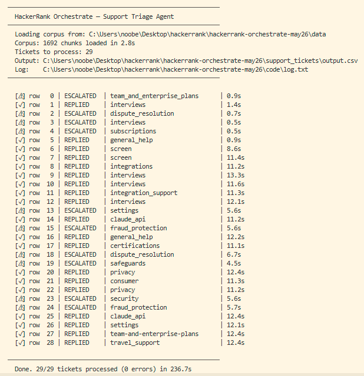

# HackerRank Orchestrate Multi-Domain Support Triage Agent

A terminal-based support triage agent that classifies, routes, and responds to support tickets across three domains: HackerRank, Claude, and Visa.



---

## How it works

Each ticket passes through a five-stage pipeline:

```
Ticket (Issue, Subject, Company)
        |
        v
[1] Invalid / out-of-scope check       — deterministic, no LLM cost
        |
        v
[2] Escalation rule gate               — keyword patterns for fraud, billing, security
        |
        v
[3] TF-IDF RAG retrieval               — top-5 chunks from corpus, company-filtered first
        |
        v
[4] LLM classification (Groq)          — request_type, product_area, escalate?, justification
        |
        v
[5] LLM response generation (Groq)     — grounded strictly in retrieved docs
        |
        v
Output row → output.csv + log.txt
```

Deterministic rules run before the LLM. They are cheaper, faster, and cannot be fooled by prompt injection or adversarial phrasing. The LLM handles everything the rules do not catch.

---

## Project structure

```
hackerrank-orchestrate-may26/
├── code/
│   ├── main.py          # CLI entry point, CSV I/O loop
│   ├── agent.py         # Per-ticket pipeline orchestration
│   ├── rag.py           # Corpus loading, chunking, TF-IDF retrieval
│   ├── classifier.py    # Groq API: classify() and generate_response()
│   ├── escalation.py    # Deterministic keyword-based escalation rules
│   ├── logger.py        # log.txt writer + terminal progress output
│   ├── requirements.txt
│   └── README.md
├── data/
│   ├── hackerrank/      # HackerRank support corpus (Markdown)
│   ├── claude/          # Claude help center corpus (Markdown)
│   └── visa/            # Visa support corpus (Markdown)
├── support_tickets/
│   ├── support_tickets.csv   # Input
│   └── output.csv            # Agent predictions
├── assets/
│   └── support_terminal_result.png
└── .env                 # GROQ_API_KEY (not committed)
```

---

## Setup

```bash
git clone https://github.com/Ruturaj-007/hackerrank-orchestrate-may26
cd hackerrank-orchestrate-may26

pip install -r code/requirements.txt
```

Create a `.env` file in the root:

```
GROQ_API_KEY=your_groq_api_key_here
```

---

## Run

```bash
cd code

# Full run — all 29 tickets
python main.py

# Test with first 5 rows only
python main.py --limit 5

# Custom paths
python main.py \
  --input  ../support_tickets/support_tickets.csv \
  --output ../support_tickets/output.csv \
  --data   ../data \
  --log    log.txt
```

Output is written to `support_tickets/output.csv`. A structured JSON-lines log is written to `code/log.txt`.

---

## Design decisions

**TF-IDF over dense embeddings.** The corpus is domain-specific and small (~1,692 chunks). Lexical overlap is a strong signal here. TF-IDF with bigrams is fully reproducible, requires no GPU, and starts in under 3 seconds.

**Company-filtered retrieval.** Retrieval first searches within the ticket's company subdirectory. If fewer than k results are found, it falls back to the global corpus. This prevents a Visa query from pulling HackerRank documentation.

**Deterministic escalation before the LLM.** Regex rules catch fraud, billing disputes, security vulnerabilities, account deletion, prompt injection, and platform outages before any LLM call is made. This is auditable, cheap, and cannot be bypassed by adversarial phrasing.

**Two separate LLM calls.** `classify()` returns structured JSON for routing decisions. `generate_response()` generates user-facing prose. Keeping them separate keeps prompts focused and makes failure modes easier to isolate.

**Temperature = 0.** All LLM calls use temperature 0 for reproducibility.

**Safe fallback.** If the LLM call fails for any reason, the ticket is escalated rather than replied to with a potentially hallucinated answer.

---

## Dependencies

| Package | Purpose |
|---|---|
| `groq` | LLM inference via Groq API |
| `scikit-learn` | TF-IDF vectorizer, cosine similarity |
| `numpy` | Array operations for retrieval scoring |
| `python-dotenv` | `.env` file loading |

Model used: `llama-3.3-70b-versatile`

---

## Results

29/29 tickets processed. 0 errors. ~237 seconds total runtime.

| Status | Count |
|---|---|
| Replied | 19 |
| Escalated | 10 |

Escalated cases include: billing disputes, refund requests, identity theft, security vulnerability reports, fraud, prompt injection attempts, and subscription changes — all correctly routed without LLM involvement.

## Acknowledgments
Special thanks to **HackerRank** for organizing this **AI Agent Orchestrate Challenge** and providing the opportunity to develop this solution.

